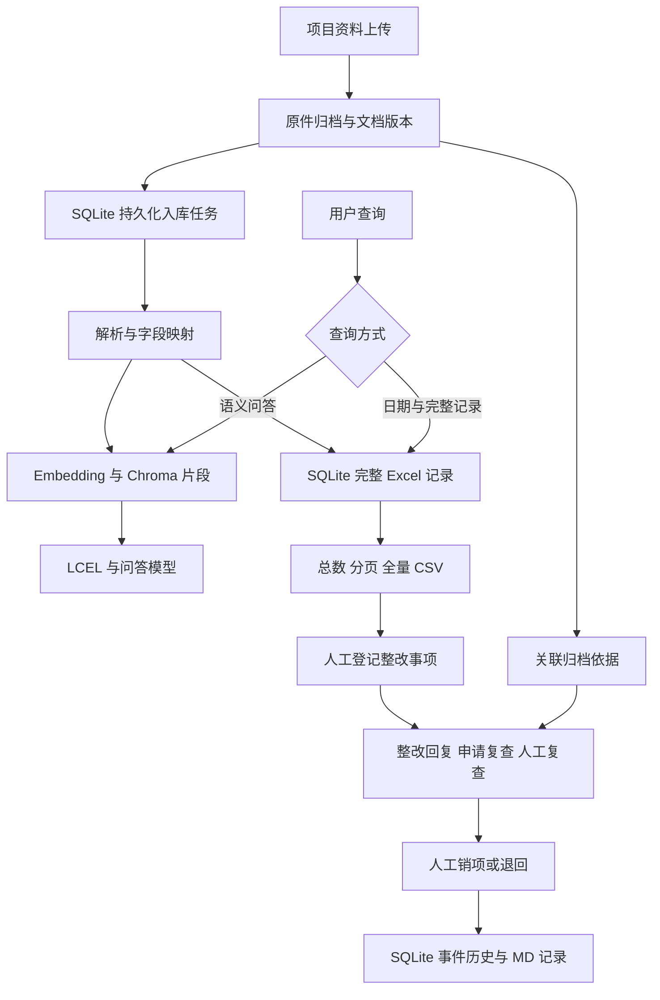

# 工程资料 RAG 与现场整改闭环：源码改动与面试面经

版本：1.1.0；更新：2026-10-08。定位：学习与作品集项目。没有真实上线规模、行业准确率提升或生产 SLA 结论。详细源码见同目录的原始源码、修改后源码和逐文件差异 MD。

## 1. 可以怎样介绍项目

> 我从两年施工现场监理工作中看到，检查记录、整改回复、施工方案等资料分散，查某一天的全部问题不能只依赖几个相似片段。所以基于课程项目与此前“监理智查”的 FastAPI、LangChain、Chroma、Streamlit 代码，整合了工程资料问答、文档台账、完整表格记录查询和现场整改资料闭环。
>
> 问规范说明走语义检索与引用；查某一天的完整清单走 SQLite 条件查询、分页与导出。入库任务保存实际状态，索引失败也保留已经解析成功的表格记录。整改流程按人工登记、回复、申请复查、复查通过或退回推进，模型和照片不会自动销项。本次验证使用隔离合成资料与真实本地服务，未声称正式落地或替代现场专业判断。

面试时只讲自己实际完成与理解的部分。课程 RAG 基线、LangChain 与开源 CAD 算法不是自行从零开发。AI 辅助代码实现可以如实说明，需要能够独立解释路由、SQL、状态转换和失败处理。

## 2. 为什么调整原来的图纸审查工作流

原整合版尝试适配已有上游 CAD 审查的问题池 JSON，检索候选规范依据。随后结合真实岗位职责，主产品改为资料查询与现场整改闭环，独立图纸审查保存到历史实验目录。

现场遇到图纸与施工条件不符时，应记录问题、联系有关单位并通过图纸会审、设计答复或变更处理。当前应用接收图纸原件和导出说明，帮助查资料与保存依据，没有自动判定设计错误的主业务入口。

## 3. 实际架构

## 4. 源代码对应关系

| 文件 | 实际改动 | 面试可解释的内容 |
|---|---|---|
| `core/document_catalog.py` | 项目、文档版本、任务、完整记录、事项和事件六张表 | SQL 范围、事务、唯一约束、数据关系 |
| `core/file_ingestion.py` | 持久化任务 Worker、字段别名、表头识别、日期处理、文件阶段能力 | 解析与索引分离、失败状态、边界 |
| `core/vector_store.py` | 按 document_id 删除旧片段后用稳定 ID 写入；初始化锁 | 重试不会重复写入、单进程并发 |
| `api/routes/upload.py` | 流式大小校验、基础类型验证、分类/日期/版本/导出件关联 | 接收成功为何返回 202 |
| `api/routes/documents.py` | 文档列表、任务详情、原件下载、完整清单与事件接口 | 业务 API 契约与 422/409 |
| `api/routes/qa.py` | 日期清单查询走 SQL；按项目、文档、会话命名记忆 | top-k 截断与范围隔离 |
| `api/dependencies.py` | 懒加载问答链 | 结构化查询不初始化 LLM |
| `core/rag_chain.py` | 请求级文档 ID 过滤，不修改共享检索器 | 避免项目之间检索串用 |
| `frontend/pages/2_📁_知识库管理.py` | 原件接收、台账、状态、重试、下载 | 用户怎样区分归档与检索 |
| `frontend/pages/4_📋_记录查询.py` | 全部匹配总数、分页、原字段、CSV、登记事项 | 业务完整性 |
| `frontend/pages/5_🛠️_现场整改.py` | 人工操作、附件、事件历史、MD 导出 | 状态机与证据关联 |
| `experiments/drawing_review/` | 历史页面和显式启动 API | 产品边界调整与源码保留 |

## 5. 重点面试问答

### 为什么不能靠向量检索回答“某一天全部检查问题”？

向量检索返回相似度较高的有限片段，`k=5` 不代表只有 5 条记录，更不能证明已列全。Excel 解析后将每个原表行保存到 SQLite，日期、项目、文档版本过滤用 SQL，先计数，再分页；CSV 遍历全部匹配行。自然语言日期清单请求可进入该路径，语义问答另走 RAG。

### 为什么同时使用 SQLite 和 Chroma？

SQLite 保存精确业务字段、版本和处理事件，适合筛选、计数与事务；Chroma 保存文本语义向量，适合解释性查询和规范检索。两个存储不是同一份结果的替代品。向量失败时表格记录仍可用，台账明确显示部分解析和零索引片段。

### 日期没有年份怎么办？

保存原值与月日，不按系统年份补齐。“9月9日”筛月日，可能匹配多个年度；完整日期只匹配明确登记年份的记录。上传时可填写已知业务日期；与单行完整日期冲突时优先保留单行日期，不无依据覆盖。

### 如何防止重复入库？

SHA256 与项目、原文件名、分类、日期、文档编号、版本标签、关联原件组成登记指纹，SQLite 唯一约束加事务保护。相同登记复用文档 ID，不再生成任务。重试写向量时按 document_id 替换稳定 `document_id:index` 片段，完整表格行使用稳定的文档/工作表/行号 ID。

### 重启如何恢复？为什么不用 Celery？

任务存 SQLite，启动时把中断的解析/索引任务恢复为排队，单个后台线程顺序处理。MVP 依赖少、部署简单。目前要求单 API 进程；多 worker、多机需增加任务租约、心跳、竞争控制和队列，不能把现有线程称为分布式任务系统。

### 怎样限制不同项目和版本？

结构化查询按 project_id，并默认 join 当前成功版本；明确指定文档可查历史版本。语义问答从台账取可检索文档 ID，再给请求创建独立检索链的 metadata filter。对话记忆命名包含项目、文档、会话，切换前端范围清空当前显示。它解决范围串用，尚不等同账号权限与企业级 ACL。

### 整改闭环有哪些状态？能让 LLM 自动销项吗？

`open → reply_received → recheck_pending → closed`，复查不通过或重新打开进入 `reopened`。服务器事务检查动作是否允许、操作人和说明是否为空、附件是否属于项目且原件存在。回复和通过需要附件。状态由人工事件驱动，LLM 不获得状态更改入口。原表“已整改”只保留为来源字段，不自动创建已销项事项。

### DWG、RVT 等是否已经解析？

DWG、RVT、IFC 本期只接收归档，不宣称完成解析。RVT 导出 PDF 才能提取文字，导出 IFC 本阶段仍仅归档。DXF 读取直接 TEXT/MTEXT 和块属性，标记部分解析，外参、嵌套块、代理对象不保证完整。扫描 PDF 无 OCR 时只归档。文件头校验不是完整文件结构验证。

### 来源怎样追溯？

原件用 UUID 路径保存，台账保留原文件名、哈希、分类、编号、版本及关联原件 ID。Excel 记录保留工作表、原行号和完整字段 JSON；PDF 源片段保留页码；DXF 片段保留布局、图层与实体 handle。整改事件关联具体文档 ID，因此依据版本不会因新文件出现而自动改变。

### 有哪些真实测量结果？

本版测试使用合成表格、文字 PDF、DXF 和本地 Ollama。验证了 25 行完整匹配与分页、重试、项目范围、CSV、人工流程、重启和前端运行；具体检查数与结果以 `工作台回归验证.json` 为准。没有正式部署用户数、模型行业准确率或“提升百分比”，不能借用参考项目数字。

## 6. 验证范围与下一步

测试入口是 `tests/test_catalog_workflow.py`、原有 `tests/test_qa_regressions.py` 和 `integration/verify_workbench.py`。测试替身验证业务约束，真实 HTTP/Chroma/Ollama 验证存储和调用链，两类结果分别说明。

目前未实现账号认证、组织权限、电子签章、OCR、IFC 属性解析、DWG 原生转换、跨进程任务租约、完整审计防篡改与领域效果评测。下一步应基于真实资料标注集验证记录解析和检索，再按场景决定资料齐套核对，而不是直接扩展大量未验收模块。

置信度：已通过测试的代码行为为高；真实工程资料适用效果为未知，需业务验收。
