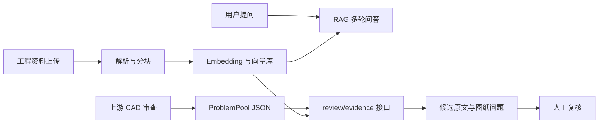

# 工程项目RAG智能问答系统：源码改动与面试面经

版本：本次代码整合记录（2026-10-07）。项目定位：学习与作品集 MVP。本文的实现结论来自实际文件；测试范围见第 6 节。

## 1. 这次到底结合了什么

| 来源 | 实际复用内容 | 本次处理 |
|---|---|---|
| 项目一 `rag_qa_system` 压缩包 | FastAPI、LCEL、多轮对话、文档解析、Embedding、Chroma/FAISS | 作为原始基线归档到 `项目一原始源码归档.md` |
| 之前修改的“监理智查” | 工程行业界面、共享 UI、多模型配置、本地启动修复 | 作为 `rag_app/` 的代码基础 |
| GitHub 仓库已有 CAD 项目 | `UnifiedIssue`、`ProblemPool`、审图入口 | 用导出脚本转换成 RAG 工作流输入 |
| 本次新增代码 | 审图问题与知识检索的接口适配 | 新增工作流 API、前端页面、复核状态及测试 |

对项目一压缩包中的 33 个 Python 文件与“监理智查”逐文件比对：10 个字节完全相同，21 个已有改动，2 个原测试文件未在该旧项目中找到。这个结果说明“监理智查”已经是项目一的衍生版本，因此本次沿用其改进代码继续整合。字节不同不代表功能已验证。

上游 CAD 与空间分析代码来自仓库已有导入，许可证保留。不能把上游审图算法描述为自己从零开发。

## 2. 面试时的一分钟介绍

> 我做的是工程项目 RAG 智能问答系统，面向施工、监理场景里查资料、查规范和复核图纸问题的需求。项目从课程 RAG 代码开始，我复用了 FastAPI、LangChain 和向量库，把之前的“监理智查”工程资料界面引入同一仓库，再适配已有开源 CAD 审查模块的问题池格式。
>
> 普通查询走文档上传、解析分块、向量检索和多轮问答；图纸问题走“审图问题导入、检索候选资料、展示来源、人工复核”。本次我主要完成代码整合、数据契约、工作流接口和页面，保留了来源文件、图纸位置和待复核状态。目前通过了两个接口函数测试及模拟资料的真实向量入库、HTTP 检索和页面运行检查；真实图纸和真实规范库的效果还需要进一步评估。

这个版本没有上线规模、准确率提升或响应时延的实测数据。参考材料中的“300 篇文档”“准确率提升 25%”“3 秒内回答”等数字不能用于介绍自己的实际项目。

## 3. 架构与代码入口



| 文件 | 作用 | 可回答的追问 |
|---|---|---|
| `rag_app/core/rag_chain.py` | LCEL 历史感知检索与生成 | 多轮追问为什么要改写 query？ |
| `rag_app/core/document_loader.py` | 格式映射、元数据、递归分块 | 怎么保留来源？扫描 PDF 如何处理？ |
| `rag_app/core/vector_store.py` | Chroma/FAISS 的持久化与检索 | 为什么选轻量向量库？ |
| `rag_app/core/review_workflow.py` | 审图问题到检索查询、复核数据包 | 两个项目如何实际结合？ |
| `rag_app/api/routes/review.py` | 输入校验与工作流 API | 怎样定义模块间的契约？ |
| `rag_app/frontend/pages/4_🧭_图纸审查.py` | 导入问题池、查看来源、下载结果 | 业务人员如何操作？ |
| `integration/export_cad_issues.py` | 调用上游审图入口并导出 JSON | 上游算法和业务应用怎样解耦？ |

## 4. 原代码与新增代码的关系

原项目一的问答接口主要完成单次调用：

```python
result = rag_chain.ask(request.question, request.session_id)
```

这个接口保持用于普通问答。新增接口处理的是一个图纸问题列表：

```python
packets = review_issues(
    request.issues,
    lambda query, top_k: store.similarity_search(query, k=top_k),
    request.top_k,
)
```

`review_issues()` 接受一个检索函数，因此业务流程可以用真实向量库运行，也可以注入测试替身验证数据契约。这里没有额外调用 LLM，结果是图纸问题与候选片段的组合，减少了新增工作流的生成环节。

查询由审查问题字段组成：

```python
fields = (
    "professional", "checkpoint_name", "description", "standard_code", "standard_clause"
)
```

例如，输入“建筑、疏散门净宽度检查、疏散门宽度待核查、规范编号”后，系统检索相应候选资料。审图模块提供的规范编号会标明是待核查字段，召回片段不会自动被认定为正确依据。

工作流按结果分流：没有候选资料时显示“待补充依据”；有候选资料且原问题为 A 级时显示“高风险人工复核”；其他问题显示“人工复核”。原始图纸名、位置、问题描述和风险级别保留在返回包中。

## 5. 高频面试问答

### 你做了什么，哪些是现成代码？

RAG 基础链路来自项目一课程代码，工程界面和多模型接入沿用之前的监理智查改动，CAD 审图算法来自仓库已有开源导入。本次我完成三个来源的代码关系梳理、RAG 模块导入、问题池 JSON 适配、工作流 API、前端复核页面、来源文本转义和函数级验证。可以展示具体代码，不把开源模块说成自研。

### 为什么把两个系统通过 JSON 接起来？

两部分的输入输出不同：CAD 系统处理图纸并产出问题对象，RAG 系统处理文本知识库。统一为问题池 JSON 后，只依赖问题 ID、图纸位置、描述和待核查条款。可以分别启动和调试，也方便以后把文件导入换成服务调用。

### 为什么没有直接把 DXF 丢进向量库？

向量库适合检索文本片段。图纸包含几何、坐标、图层和专业关系，直接按字符串切分会丢失这些信息。当前由上游 CAD 模块处理图纸，将问题对象交给 RAG 查候选资料；图纸解析与文字资料检索的职责明确。

### 多轮对话中的“它”如何处理？

原有 LCEL 链使用 `create_history_aware_retriever`。先根据历史把追问补成独立问题，再检索。对话历史只是改写输入，不能保证每次指代都正确；需要用有明确预期的多轮问题集评估。

### Reranker 在哪里？

原有 `core/retriever.py` 支持可选 CrossEncoder 重排，普通 RAG 链可以启用。新增图纸工作流当前直接调用向量库的 `similarity_search`，还没有接重排器；不能把原 RAG 链的配置误说成新工作流也已启用。

### 为什么选择 Chroma？

课程与本地 MVP 需要易启动、可持久化的向量库，Chroma 已在基础代码中使用。是否迁移到其他数据库应根据真实数据量、并发、过滤、备份和运维要求评估；本项目没有压测证明其规模上限。

### 怎么减少幻觉？

普通 RAG 链有上下文不足时拒答的提示规则和来源片段。新图纸流程直接展示候选资料、保留人工复核状态，不让召回结果自动变成合规结论。下一步应做版本校验、条款匹配和来源准确性评估；仅有提示词不能证明消除了幻觉。

### 上传成功是否等于入库成功？

不等于。原代码使用 FastAPI `BackgroundTasks`：请求先保存文件并返回，解析和向量入库随后执行。当前缺少持久化任务状态，因此还不能在界面准确展示每个文件是否已入库。这是明确的后续优化项。

### 是完整私有化部署吗？

Embedding 和向量库可以本地运行，LLM 支持 Ollama 和云端兼容接口。使用云端 LLM 时，问答上下文会进入所配置的服务；是否完全本地取决于实际配置。当前不能统一声称“所有数据不出内网”。

### 为什么缺少扫描件 OCR？

原 PDF 加载器主要提取文本，未发现完整 OCR 流程。因此扫描件支持没有被证实。真实项目需增加 OCR、表格与版面解析，并保存页码和区域坐标，之后再做检索评估。

### 怎么证明本次改动有效？

本次用假向量库输入两条上游格式的问题，验证来源字段保留、A 级问题转人工复核、未召回时要求补依据；还验证缺少问题描述返回 422。两个测试通过。这证明函数数据流符合这些用例，不证明真实检索准确率或工程结论正确。

### 如果问项目性能，怎么回答？

当前没有可引用的完整实测数字。我会先固定机器、模型、文档集和问题集，记录解析时间、索引时间、检索时延、生成时延和端到端分位数，再报告结果。不能把教程或参考话术的数字当成自己的测量。

## 6. 本次验证记录

| 项目 | 结果 | 说明 |
|---|---|---|
| Python 编译检查 | 通过 | 新引入与新增 Python 文件可编译 |
| 工作流函数测试 | 2/2 通过 | 用测试替身验证结果和缺字段校验 |
| HTTP 集成检查 | 通过 | 隔离进程环境运行 API；模拟资料上传、真实 Embedding 入库、审查检索返回 200，缺描述返回 422 |
| CAD 演示运行 | 通过 | 上游实际创建并导出 7 条模拟问题；不代表真实审图效果 |
| 真实资料与图纸效果 | 未验证 | 没有本次真实样本与标注集 |
| 页面运行检查 | 通过 | Streamlit AppTest 验证首页与带 7 条结果的工作流页面；发现并修复嵌套折叠面板错误 |
| 页面视觉验证 | 未完成 | 页面运行检查不能替代浏览器视觉验收 |

## 7. 演示时的顺序

1. 展示根目录 README，说明三个代码来源与自己的改动范围。
2. 展示项目一原始源码归档与新增 `review_workflow.py`，说明接口组合方式。
3. 在有可用模型和 API 的环境中上传工程资料，等待入库后做普通查询。
4. 导入模拟问题 JSON，展示候选资料与“待补充依据 / 人工复核”状态。
5. 运行函数测试，解释测试覆盖及真实业务验证尚未完成的部分。

## 8. 可用于作品集的项目描述

> 基于课程 RAG 项目与开源 CAD 审查模块，整合工程资料智能查询应用；使用 FastAPI、LangChain、Chroma 与 Streamlit 构建资料上传、多轮问答和来源展示，新增审图问题池 JSON 到知识库候选依据的工作流接口与复核页面，完成字段校验、风险分流及函数级测试。

如需写进简历，应根据自己的实际参与程度调整“实现”“整合”“学习”等动词。当前不使用“企业正式上线”“自研审图算法”或未经测量的性能提升数字。

全文源码：[项目一原始源码归档](项目一原始源码归档.md)、[修改后整合源码归档](修改后整合源码归档.md)、[项目一到整合版改动对照](项目一到整合版改动对照.md)。
